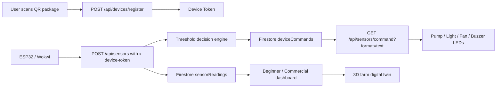
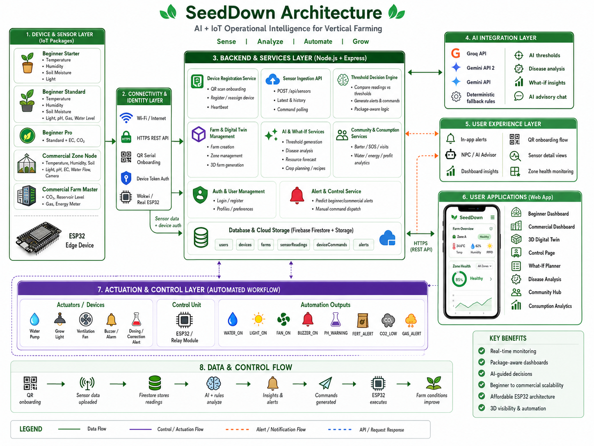
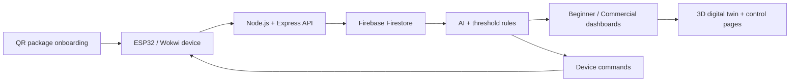

# SeedDown

<p align="center">
  <b>SeedDown is an AI farm operations bot that monitors IoT sensor data, diagnoses farm issues, recommends actions, and sends safe automation commands back to ESP32 devices.</b>
</p>

<p align="center">
  
  
  
  
  
</p>

---

## Table of Contents

- [Track & Problem Statement](#track--problem-statement)
- [Introduction](#introduction)
- [Live Deployment](#live-deployment)
- [Rubric Alignment](#rubric-alignment)
- [System Flow](#system-flow)
- [System Architecture](#system-architecture)
- [Core Features](#core-features)
- [Beginner vs Commercial](#beginner-vs-commercial)
- [IoT Packages](#iot-packages)
- [Automation Logic](#automation-logic)
- [Technical Stack](#technical-stack)
- [Installation](#installation)
- [Environment Variables](#environment-variables)
- [Cloud Deployment](#cloud-deployment)
- [Wokwi Simulation](#wokwi-simulation)
- [API Reference](#api-reference)
- [Project Structure](#project-structure)
- [Real-Life Deployment Budget](#real-life-deployment-budget)
- [Future Improvements](#future-improvements)
- [Contributors](#contributors)

---

## Track & Problem Statement

**Hackathon:** FlowZint AI Hackathon  
**Track:** Open Innovation for Innovation  
**Team:** next level utm  
**Project Name:** SeedDown  
**Solution Type:** Closed-loop AI farm operations bot + IoT automation backend + responsive web dashboard + 3D digital twin

SeedDown targets a real-world food and sustainability problem: urban growers and vertical farm operators need affordable AI support to understand their farm data, react before crops fail, and reduce wasted water, energy, and labour.

For **beginners**, the biggest gap is confidence. Many new growers do not know what sensor readings mean, when a plant is stressed, or what action to take next.

For **commercial farms**, the challenge is operational intelligence. Operators need zone-level monitoring, early risk detection, safe automation, and planning support before scaling a farm or changing crop strategy.

SeedDown addresses this as a closed-loop AI farm operations bot. It does not only answer questions: it observes IoT sensor data, reasons over farm context, recommends the next action, and converts safe decisions into ESP32-readable automation commands. The system can:

- Monitor live farm conditions from real or simulated IoT devices.
- Combine multi-modal farm context: sensor readings, farm structure, crop type, image/camera input, and business/resource planning.
- Diagnose abnormal readings, disease risk, and resource issues.
- Recommend next actions through AI chat, farm advisor, and What-If planning.
- Generate safe threshold and automation commands for ESP32 actuators.
- Fall back to deterministic safety rules when AI quota, keys, or network access fail.
- Support beginner home growers and commercial zone-based farms in one workflow.
- Visualize farm operations through interactive 3D digital twin dashboards.

---

## Introduction

SeedDown is a smart vertical farming platform built around a real IoT loop:

```text
ESP32 sensor node
-> Node.js backend
-> Firebase Firestore
-> AI / rule-based decision logic
-> Web dashboard
-> ESP32 actuator command
```

The system supports two user types:

- **Beginner Mode**: guided single-field or home-scale growing with package-based sensors, photo-assisted 3D farm setup, simple alerts, and friendly explanations.
- **Commercial Mode**: multi-zone farm onboarding, Farm Master / Zone Node device assignment, per-zone thresholds, control tools, disease analysis, camera view, What-If planning, and a larger digital twin.

---

## Live Deployment

| Resource | Link | Notes |
|---|---|---|
| Production Web App | https://seed-down.vercel.app/ | Public SeedDown demo for judges and product walkthrough. |
| Repository | Current GitHub repo | Source code, setup guide, API reference, architecture, and IoT simulation files. |

Backend credentials, Firebase service accounts, and AI API keys are intentionally excluded from the repository. The public app link is the primary judge-facing deployment entry point.

---

## Rubric Alignment

| Evaluation Area | How SeedDown Aligns |
|---|---|
| Model Innovation & Novelty | Uses multi-modal intelligence across IoT sensor readings, farm structure, crop type, image/camera input, and business/resource planning. Unlike a normal chatbot, SeedDown can turn AI reasoning into safe ESP32 command logic. |
| Real-World Applicability | Targets urban farming and commercial vertical farms with low-cost ESP32 devices, resource-saving automation, sustainability decisions, and beginner-to-commercial workflows. |
| Technical Architecture | Implements a closed loop from device-token IoT APIs to Firestore readings, AI/fallback reasoning, command generation, public web deployment, and ESP32/Wokwi actuation. |
| Documentation Clarity | Provides setup steps, API reference, system architecture, Wokwi simulation guide, deployment instructions, and a judge-oriented demo flow. |

---

## System Flow



## System Architecture

<p align="center">
  
</p>

SeedDown's architecture is production-oriented because it shows the complete operational loop: package-based ESP32 devices, QR identity, secure backend ingestion, Firestore storage, AI/rule decisions, dashboard views, and actuator commands.



Architecture layers:

- **Device & Sensor Layer**: Beginner and Commercial ESP32 packages collect environment readings.
- **Connectivity & Identity Layer**: WiFi, HTTPS REST API, QR serial onboarding, and device-token authentication.
- **Backend & Services Layer**: Node.js / Express handles device registration, sensor ingestion, thresholds, alerts, control, farm management, and user auth.
- **Database & Cloud Storage**: Firebase Firestore stores users, devices, farms, readings, commands, and alerts.
- **AI Integration Layer**: Groq/Gemini provider chain plus deterministic fallback rules for What-If, disease, thresholds, and advisory chat.
- **User Experience Layer**: Beginner dashboard, Commercial dashboard, 3D digital twin, Control, Disease, What-If, Community, and analytics pages.
- **Actuation & Control Layer**: Wokwi/ESP32-supported outputs such as water pump, fan, buzzer, pH warning, fertilizer alert, CO2 low, and gas alert. Grow light support is treated as an optional package output, not a required 3D model change.

---

## Core Features

### 1. Device Token IoT Architecture

Every ESP32 package has a QR serial:

```text
SD-BGN-STR-00123   Beginner Starter
SD-BGN-STD-00456   Beginner Standard
SD-BGN-PRO-00789   Beginner Pro
SD-COM-ZON-01001   Commercial Zone Node
SD-COM-FRM-03001   Commercial Farm Master Node
```

When the QR is scanned, the frontend calls:

```http
POST /api/devices/register
```

The backend parses the serial, validates the package type, generates or resolves a `deviceId`, and returns a `deviceToken`. ESP32 devices authenticate with:

```http
x-device-token: <deviceToken>
```

### 2. Real-Time Sensor Monitoring

The backend accepts sensor readings through:

```http
POST /api/sensors
```

Supported fields include:

- `temperature`
- `humidity`
- `soilRaw`
- `lightRaw`
- `ph` / `phRaw`
- `gasRaw`
- `waterDistanceCm`
- `ec` / `ecRaw`
- `co2Ppm` / `co2Raw`
- `energyKwh`
- `intervalSeconds`

Readings are saved with device context:

```text
deviceId
farmId
fieldId
zoneId
packageLevel
```

### 3. Package-Based Sensor Capability

The dashboard does not show unavailable sensors for smaller packages.

| Package | Dashboard Sensors |
|---|---|
| Beginner Starter | Temperature, humidity, light |
| Beginner Standard | Temperature, humidity, light, pH, water level, gas |
| Beginner Pro | Standard sensors plus EC and CO2 |
| Commercial Zone Node | Zone temperature, humidity, soil, light, pH, EC, CO2, water flow, camera |
| Commercial Farm Master | Farm-level CO2, water reservoir, gas, energy |

This means a Standard package will not pretend to have Pro-only EC / CO2 data.

### 4. Automated Farm Commands

The backend compares readings with stored thresholds and creates combined commands:

```text
WATER_ON
LIGHT_ON
FAN_ON
BUZZER_ON
PH_WARNING
FERT_ALERT
CO2_LOW
GAS_ALERT
NO_ACTION
```

ESP32 fetches pending commands through:

```http
GET /api/sensors/command?deviceId=<deviceId>&format=text
```

The text response is ESP32-friendly:

```text
COMMAND|intervalSeconds|commandId
```

### 5. AI Threshold Generation

SeedDown generates thresholds from plant type, package level, and user goals:

```http
POST /api/ai/generate-thresholds
```

AI provider order:

```text
GROQ_API_KEY
GEMINI_API_KEY_2
GEMINI_API_KEY
```

If AI quota, key, or network fails, SeedDown uses deterministic fallback thresholds so the app still works. Pages that depend on AI analysis, such as What-If and ESG, should label these results as benchmark estimates instead of pretending they came from live AI.

Safety thresholds are not relaxed by AI:

- Gas danger threshold
- Water low / critical threshold
- Emergency buzzer behaviour

### 6. Photo Analysis and 3D Structure Recognition

Beginner setup can upload or capture a farm photo. The backend AI attempts to detect:

- Plant type
- Estimated plant count / slot usage
- Rack or structure type
- Tiers and slots per tier
- Confidence score

The detected structure is saved as `rackConfig`, `rackTypeId`, `rackLabel`, and `plantSlots`, so the 3D preview remains consistent after logout and login.

### 7. Beginner 3D Farm Canvas

Beginner farms use a lighter 3D view:

- Rack / tower / wall / channel style layouts.
- Plant emoji and crop labels.
- Add, change, and delete plants.
- Clickable plant slots.
- Orbit controls for move and zoom.
- WebGL fallback preview if the browser disables WebGL.

### 8. Commercial Digital Twin

Commercial farms use a separate larger digital twin:

- Farm-level and zone-level view.
- Farm Master Node and Zone Node mapping.
- Multiple zones such as Zone A / Zone B / Zone C.
- Sensor and output markers inside the 3D scene.
- Camera tool for zone snapshot / live-view style inspection.
- Right-side operations panel with sensors, advisor, tools, and chat.
- Active device assignment is the canonical zone routing rule. Firmware `zoneId` is used only as fallback.
- Live sensor cards cache the last successful reading per farm/zone and show the last updated time instead of jumping to unrelated fallback values.

### 9. Disease Analysis

SeedDown includes a dedicated disease and plant health analysis page for commercial workflows. The idea is that each commercial zone can have a camera or uploaded image, and the operator can run diagnosis when a plant looks abnormal.

```http
POST /api/ai/disease-analysis
```

The disease flow is designed to reduce risky one-shot AI guesses. It can:

- Use the current farm context, selected plant, and image input.
- Identify likely disease, nutrient, watering, light, or environmental stress causes.
- Return a confidence score instead of pretending every answer is certain.
- Explain why the confidence level is high or low.
- Recommend practical recovery steps such as isolation, pruning, airflow changes, pH check, nutrient adjustment, or watering correction.
- Ask follow-up questions when the image is unclear or the model cannot decide safely.

Disease is advisory in the current system. It explains confidence, likely causes, and recovery steps, but it does not automatically send `WATER_ON`, `FAN_ON`, or other IoT commands.

This feature is useful for commercial farms because a disease issue in one zone can spread quickly. By connecting disease analysis with zone-level data, SeedDown can help the operator decide whether the problem is visual disease, nutrient imbalance, humidity stress, or sensor-triggered environmental stress.

### 10. What-If and Resource Planning

SeedDown includes What-If planning so users can test a decision before changing the real farm.

For beginner growers, What-If helps answer questions such as:

- What happens if I add tomato, cucumber, basil, or lettuce to my rack?
- Will the farm still have enough space?
- How many plants can fit based on the current rack structure?
- Which crop is easier for the current sensor environment?
- What recipe or usage ideas can I make from the crop I grow?

For commercial users, What-If Pro is more business-focused:

- Estimate yield based on plant count, crop type, and current farm status.
- Estimate profit from the selected crop and expected production.
- Compare energy usage and likely operating cost.
- Check how adding a new plant affects zone capacity and resource demand.
- Use market price and crop data to support planting decisions.
- Support commercial planning before expanding zones or changing crop mix.

What-If can use backend AI endpoints such as `/api/whatif/newplant`, `/api/whatif/costsaving`, and market/resource analysis flows. If AI is unavailable, SeedDown should keep the page usable with clearly labelled benchmark estimates.

The goal is to move the user from passive monitoring to active decision-making. Instead of only showing "what is happening now", SeedDown helps answer "what should I do next?"

### 11. Eco Save and Consumption Tracking

Eco Save focuses on reducing water and electricity waste while still keeping crops healthy.

Current SeedDown logic supports resource-conscious decisions through:

- Watering only when soil or humidity conditions require it.
- Turning grow lights on only when light level is below threshold.
- Activating fan / ventilation only when temperature, gas, humidity, or CO2 conditions require it.
- Sensor interval control so stable farms do not need unnecessary high-frequency readings.
- Energy and profit pages that estimate operating impact from live or historical sensor data.
- Consumption / ESG views that help commercial users understand resource use.

This is important for the case study because vertical farming can become expensive when lights, pumps, and ventilation run continuously. SeedDown's automation logic is designed around condition-based actuation instead of always-on operation.

### 12. Control and Automation Center

The Control page is the operator-facing automation panel.

For Beginner mode, control stays simple and focuses mainly on safe interval and basic automation behaviour. For Commercial mode, control becomes more detailed:

- View or edit threshold values.
- Sync threshold preferences to the backend.
- Send manual actuator commands such as `WATER_ON`, `LIGHT_ON`, `FAN_ON`, or emergency commands.
- Review latest pending command from the backend.
- Get AI recommendation warnings when a threshold is set too far outside a safe range.
- Separate farm-level and zone-level thinking for commercial use.

This page matters because commercial farms need override ability. The system can automate routine action, but the operator still needs manual control when testing hardware, handling emergencies, or tuning a zone.

For Wokwi firmware compatibility, alert actions and manual commands should stay within the supported command set: `WATER_ON`, `LIGHT_ON`, `FAN_ON`, `BUZZER_ON`, `PH_WARNING`, `FERT_ALERT`, `CO2_LOW`, `GAS_ALERT`, and `NO_ACTION`.

### 13. Farm Advisor and AI Chat

SeedDown includes advisor-style guidance so users do not only see raw numbers.

The advisor can explain:

- Why a sensor is abnormal.
- What the likely crop impact is.
- Whether the situation is warning or danger.
- What action the system is taking.
- What a beginner should check first.
- What a commercial operator should monitor across zones.

The AI chat is especially useful for:

- Crop care questions.
- Sensor reading interpretation.
- Harvest timing.
- Plant management.
- Disease risk.
- Energy and resource questions.
- Commercial planning prompts.

This makes SeedDown friendlier for beginners while still useful for commercial operators who need quick explanations.

### 14. Community Farming

SeedDown includes community features:

- Plant SOS posts.
- Comments and rewards.
- Crop / seed barter.
- Reserve and complete barter trades.
- Visit neighbor farms.
- Water neighbor plants.
- Catch bugs for reward coins.

The community feature is not just decoration. It supports the beginner problem: many first-time urban farmers give up because they have no one to ask. SOS posts, comments, rewards, and neighbor visits create a light support system around the farm dashboard.

---

## Beginner vs Commercial

### Beginner Add New Field

Current Beginner flow:

```text
1. Scan QR + WiFi
2. Field info
3. Photo analysis
4. Goal priority + AI thresholds
5. 3D preview + confirm
```

Beginner goals:

- Healthy Growth
- Eco Save
- Low Maintenance
- Fast Harvest
- Cost Efficient
- Beginner Safe

### Commercial Add New Farm

Current Commercial flow:

```text
1. Farm basic info
2. Photo analysis for farm structure
3. Commercial goal priority
4. Farm-level and zone-level thresholds
5. Scan devices one by one and assign to Farm Master / Zones
6. 3D farm overview + launch
```

Commercial goals:

- Maximum Yield
- Profit Optimisation
- Crop Safety First
- Research & Testing
- Automation First
- Compliance & Audit

Commercial is not treated as a bigger Beginner mode. It uses a different product flow with Farm Master and Zone Nodes.

---

## IoT Packages

### Beginner Packages

| Package | Serial Prefix | Intended User | Sensors |
|---|---|---|---|
| Beginner Starter | `SD-BGN-STR` | First-time home grower | DHT, soil, light |
| Beginner Standard | `SD-BGN-STD` | Balanced home vertical farm | DHT, soil, light, pH, gas, water level |
| Beginner Pro | `SD-BGN-PRO` | Advanced home kit | Standard plus EC and CO2 |

### Commercial Packages

| Package | Serial Prefix | Role |
|---|---|---|
| Commercial Farm Master | `SD-COM-FRM` / `SD-COM-MST` | Farm-level CO2, reservoir, gas, energy |
| Commercial Zone Node | `SD-COM-ZON` | Zone-level crop environment and actuator control |
| Legacy Commercial Zone Basic | `SD-COM-ZNB` | Supported legacy zone node |
| Legacy Commercial Zone Pro | `SD-COM-ZNP` | Supported legacy expanded zone node |

### Farm vs Zone Sensors

| Scope | Sensors / Outputs |
|---|---|
| Farm Level | CO2, water reservoir level, gas, energy meter, main ventilation fan, emergency buzzer |
| Zone Level | Temperature, humidity, soil moisture, light, pH, EC, water flow, pump, grow light, zone fan, active buzzer, camera |

---

## Automation Logic

| Condition | Command | Wokwi Output | Real-Life Meaning |
|---|---|---|---|
| Gas above danger threshold | `GAS_ALERT,BUZZER_ON,FAN_ON` | Red LED / buzzer / fan LED | Emergency alarm and ventilation |
| Temperature below min | `BUZZER_ON` | Red LED / buzzer | Cold stress alert |
| Temperature above max | `FAN_ON,BUZZER_ON` | Fan LED / buzzer | Cooling or ventilation response |
| Humidity below min | `WATER_ON` | Pump LED | Irrigation or misting support |
| Humidity above max | `FAN_ON` | Fan LED | Ventilation response |
| Soil is dry | `WATER_ON` | Pump LED | Water pump relay |
| Light is too low | `LIGHT_ON` | Grow light LED | Grow light relay |
| pH outside range | `PH_WARNING` | Orange LED | pH correction alert |
| EC outside range | `FERT_ALERT` | Green LED | Nutrient / fertilizer alert |
| CO2 below minimum | `CO2_LOW` | Blue LED | CO2 / ventilation strategy |
| Reservoir water low | `BUZZER_ON` | Buzzer | Refill tank alert |
| Stable environment | `NO_ACTION` | No LED | No actuator needed |

Multiple conditions can combine into one command string.

---

## Technical Stack

### Frontend

- Vite
- Vanilla JavaScript modules
- Three.js
- Firebase Web SDK
- jsQR
- QRCode
- Responsive CSS

### Backend

- Node.js
- Express
- Firebase Admin SDK
- Firestore
- bcrypt
- JSON Web Token authentication
- Groq / Gemini AI provider chain

### IoT

- ESP32
- PlatformIO
- Wokwi
- DHT22 / DHT style simulation
- HC-SR04 simulation
- Potentiometers for unsupported analog sensors
- LEDs as actuator stand-ins

---

## Installation

### Prerequisites

- Node.js 18+
- npm
- Firebase project with Firestore enabled
- Firebase service account JSON
- PlatformIO or Wokwi for IoT simulation

### Backend

```bash
cd backend
npm install
npm start
```

Expected:

```text
Firebase Firestore connected
SeedDown backend -> http://localhost:3000
```

### Frontend

Open another terminal:

```bash
cd frontend
npm install
npm run dev
```

Open:

```text
http://localhost:5173
```

### Build Frontend

```bash
cd frontend
npm run build
```

---

## Environment Variables

Create `backend/.env`:

```env
PORT=3000
JWT_SECRET=your_jwt_secret
FIREBASE_PROJECT_ID=your_firebase_project_id

# Render recommended:
FIREBASE_SERVICE_ACCOUNT_JSON={"type":"service_account",...}

# Local development option:
GOOGLE_APPLICATION_CREDENTIALS=./firebase-service-account.json

# AI provider chain:
GROQ_API_KEY=your_groq_key
GEMINI_API_KEY_2=your_backup_gemini_key
GEMINI_API_KEY=your_gemini_key

# Optional external 3D proxy:
DA3_SERVICE_URL=your_optional_3d_service_url
```

Create `frontend/.env` only if Firebase Web SDK features are needed:

```env
VITE_API_BASE=https://your-seeddown-backend.onrender.com
VITE_FIREBASE_API_KEY=your_web_api_key
VITE_FIREBASE_AUTH_DOMAIN=your_project.firebaseapp.com
VITE_FIREBASE_PROJECT_ID=your_project_id
VITE_FIREBASE_STORAGE_BUCKET=your_project.firebasestorage.app
VITE_FIREBASE_MESSAGING_SENDER_ID=your_sender_id
VITE_FIREBASE_APP_ID=your_web_app_id
```

Do not commit service account files or real API keys.

## Cloud Deployment

Full step-by-step deployment instructions are in [DEPLOYMENT.md](DEPLOYMENT.md).

Recommended production deployment:

- Deploy `backend` to Render using `render.yaml`.
- Render backend is configured for the Free instance type.
- Deploy `frontend` to Vercel with project root `frontend`.
- In Vercel, set `VITE_API_BASE` to the Render backend URL.
- In Render, set `JWT_SECRET`, `FIREBASE_PROJECT_ID`, and `FIREBASE_SERVICE_ACCOUNT_JSON`.
- Optional AI/service keys: `GROQ_API_KEY`, `GEMINI_API_KEY`, `GEMINI_API_KEY_2`, `DA3_SERVICE_URL`.

After Render deploys, open the backend root URL and confirm it returns:

```json
{ "status": "SeedDown API running" }
```

After Vercel deploys, open the site and confirm browser network requests go to the Render URL for `/api/...`.

---

## Wokwi Simulation

Package folders:

```text
iot/wokwi/beginner_starter
iot/wokwi/beginner_standard
iot/wokwi/beginner_pro
iot/wokwi/commercial_zone
iot/wokwi/commercial_master
```

Wokwi validates the SeedDown IoT loop before physical deployment. Legacy Wokwi sketches may still use `farm_001`, while current device flows should use QR registration and `x-device-token`.

Each package contains:

```text
sketch.ino
diagram.json
platformio.ini
wokwi.toml
src/main.cpp
```

Wokwi-supported components are used directly where possible:

- DHT22
- HC-SR04

Unsupported sensors are simulated with potentiometers:

- Soil moisture
- LDR light
- pH
- EC
- CO2
- MQ-2 gas
- Power meter

Actuators are simulated with labelled LEDs:

- Water pump
- Grow light
- Fan
- Buzzer
- pH warning
- Fertilizer alert
- CO2 low
- Gas alert

Commercial alert action buttons map to Wokwi-supported commands only:

| Commercial risk | Command sent |
|---|---|
| Water depletion | `BUZZER_ON` |
| Energy overload | `NO_ACTION` |
| CO2 crisis | `FAN_ON,CO2_LOW` |
| Zone heat | `FAN_ON` |
| Zone rot / airflow risk | `FAN_ON` |
| EC burn / EC deficient | `FERT_ALERT` |
| Zone clog | `WATER_ON` |
| Unknown alert | `BUZZER_ON` |

This keeps the simulated firmware aligned with the same command set used by the web dashboard and backend command queue.

---

## API Reference

### Auth

| Method | Endpoint | Purpose |
|---|---|---|
| POST | `/api/auth/register` | Register user with mode |
| POST | `/api/auth/login` | Login and receive JWT |

### Devices

| Method | Endpoint | Purpose |
|---|---|---|
| POST | `/api/devices/register` | Register QR serial and assign device token |
| GET | `/api/devices/:deviceId` | Get device record |
| GET | `/api/devices/by-token` | Resolve device by token |
| POST | `/api/devices/heartbeat` | Mark device online / update assignment |

### Sensors

| Method | Endpoint | Purpose |
|---|---|---|
| GET | `/api/sensors` | Route info |
| POST | `/api/sensors` | Save reading and generate command |
| GET | `/api/sensors/latest?deviceId=...` | Latest reading by device |
| GET | `/api/sensors/latest?zoneId=...` | Latest reading by zone |
| GET | `/api/sensors/latest?fieldId=...` | Latest reading by field |
| GET | `/api/sensors/history?deviceId=...&limit=20` | Reading history |
| GET | `/api/sensors/command?deviceId=...&format=text` | ESP32 command polling |
| POST | `/api/sensors/command` | Manual command |
| POST | `/api/sensors/command-result` | Mark command executed |
| GET | `/api/sensors/preferences?deviceId=...` | Get thresholds |
| PUT | `/api/sensors/preferences` | Update thresholds |

### Farms

| Method | Endpoint | Purpose |
|---|---|---|
| GET | `/api/farms` | Load farms owned by logged-in user |
| POST | `/api/farms/create` | Save beginner field or commercial farm |
| POST | `/api/farms/scan-plants` | AI plant and structure analysis |
| POST | `/api/farms/analyze-disease` | Disease analysis route |
| POST | `/api/farms/generate-3d` | Optional 3D proxy |

### AI

| Method | Endpoint | Purpose |
|---|---|---|
| POST | `/api/ai/generate-thresholds` | Plant x goal threshold generation |
| POST | `/api/ai/disease-analysis` | Disease analysis with image or follow-up mode |
| POST | `/api/chat` | Farm advisor chat |

### What-If / Crops / Community

| Method | Endpoint | Purpose |
|---|---|---|
| GET | `/api/crops/all` | Crop database |
| GET | `/api/crops/species/:name` | Crop details |
| POST | `/api/whatif/forecast` | Forecast yield |
| POST | `/api/whatif/costsaving` | Cost saving analysis |
| POST | `/api/whatif/newplant` | New plant impact |
| GET / POST | `/api/community/...` | SOS posts, barter, visits, rewards |

---

## Project Structure

```text
SeedDown/
├── backend/
│   ├── src/
│   │   ├── config/
│   │   ├── controllers/
│   │   ├── middleware/
│   │   ├── models/
│   │   ├── routes/
│   │   └── services/
│   ├── crops_data.json
│   ├── garden_recipes.json
│   ├── seed_crops.js
│   ├── seed_demo_iot.js
│   ├── app.js
│   ├── server.js
│   └── package.json
│
├── frontend/
│   ├── css/
│   ├── js/
│   │   ├── components/
│   │   ├── pages/
│   │   ├── services/
│   │   ├── utils/
│   │   ├── main.js
│   │   └── store.js
│   ├── index.html
│   └── package.json
│
├── iot/
│   ├── vertical-farming-esp32/
│   └── wokwi/
│       ├── beginner_starter/
│       ├── beginner_standard/
│       ├── beginner_pro/
│       ├── commercial_zone/
│       └── commercial_master/
│
├── shared/
├── package.json
└── README.md
```

---

## Real-Life Deployment Budget

Budget estimate for ESP32-based deployment in Malaysia. Prices are prototype ranges; supplier, calibration quality, waterproofing, and industrial sensor grade can change the final cost.

| Component | Approx. Cost (RM) | Used By | Role |
|---|---:|---|---|
| NodeMCU ESP32 / ESP32 DevKit | 11 - 25 | All packages | WiFi controller and GPIO edge node |
| DHT11 / DHT22 module | 6 - 13 | Beginner, Commercial Zone | Air temperature and humidity |
| Capacitive soil moisture sensor | 3 - 6 | Beginner, Commercial Zone | Root-zone moisture trend |
| LDR / light sensor module | 3 - 6 | Beginner, Commercial Zone | Light level detection |
| MQ gas sensor module | 3 - 12 | Beginner Standard+, Farm Master | Gas / smoke safety signal |
| HC-SR04 ultrasonic sensor | 6 - 10 | Beginner Standard+, Farm Master | Water reservoir level |
| Analog pH sensor kit | 25 - 60 | Beginner Standard+, Commercial Zone | Nutrient acidity / alkalinity |
| EC / TDS nutrient sensor | 25 - 90 | Beginner Pro, Commercial Zone | Nutrient strength estimate |
| RS485 soil EC / industrial nutrient sensor | 290 - 360 | Commercial Zone upgrade | More robust commercial EC/moisture measurement |
| CO2 sensor module | 45 - 120 | Beginner Pro, Farm Master | CO2 and ventilation decisions |
| Water-flow sensor | 8 - 20 | Commercial Zone | Irrigation flow / clog detection |
| ESP32-CAM or camera module | 25 - 80 | Commercial Zone add-on | Visual inspection / disease image input |
| Current sensor / energy meter | 12 - 45 | Commercial Farm Master | Pump, fan, and lighting energy tracking |
| 5V mini water pump | 5 - 20 | Beginner, Commercial Zone | Irrigation output |
| LED strip / grow light output | 2 - 30 | Beginner, Commercial Zone | Supplemental lighting output |
| Small DC fan | 2 - 18 | Beginner Standard+, Commercial | Ventilation output |
| Active buzzer | 2 - 5 | All packages | Local alert output |
| Relay / MOSFET driver module | 2 - 12 | All actuator packages | Safe switching for pump, fan, light, buzzer |
| 5V power supply / adapter | 4 - 25 | All packages | External actuator and controller power |
| Wiring, enclosure, connectors | 10 - 40 | All packages | Field installation and protection |

### Package Cost Estimate

| Package | Included Hardware Scope | Estimated Prototype Cost (RM) |
|---|---|---:|
| Beginner Starter | ESP32, DHT, soil moisture, light sensor, buzzer/basic output wiring | 30 - 60 |
| Beginner Standard | Starter + pH, MQ gas, water-level sensor, pump/fan/relay outputs | 80 - 150 |
| Beginner Pro | Standard + EC/TDS, CO2, water-flow or expanded nutrient monitoring | 170 - 330 |
| Commercial Zone Node | ESP32 zone controller, climate sensors, pH/EC, water flow, actuator relay outputs, optional camera connector | 250 - 650 |
| Commercial Farm Master | Farm-level ESP32 controller, reservoir level, gas, CO2, energy/current sensor, fan/buzzer relays | 130 - 320 |
| Commercial Camera Add-on | ESP32-CAM or browser/USB camera capture path, mounting and enclosure | 30 - 90 |
| Industrial Nutrient Upgrade | RS485 EC or 7-in-1 soil/nutrient probe for higher durability | 290 - 1,000+ |

Reference points used for the ranges include local ESP32 fertigation BOM examples, Robotronik DHT11 pricing, and Myduino RS485 EC / 7-in-1 soil sensor listings.

Important real wiring notes:

- ESP32 logic is 3.3V.
- Use voltage dividers for 5V echo / analog signals when needed.
- Do not power pump, fan, or LED strip directly from ESP32 GPIO.
- Use relay or MOSFET drivers for actuators.
- pH and EC sensors require calibration for real deployment.

---

## Future Improvements

### 1. Predictive Farm Simulation

Add a timeline slider that lets operators scrub forward up to 14 days and preview likely farm outcomes.

Planned inputs:

- Current sensor readings.
- Historical zone trends.
- Crop type and growth stage.
- Light, watering, temperature, pH, EC, and CO2 thresholds.
- Planned crop additions or removals.

Expected output:

- Predicted yield range.
- Likely energy and water demand.
- Crop stress risk.
- Visual 3D time-lapse of rack or zone condition.
- Recommended adjustment before the risk becomes real.

This would turn SeedDown from a monitoring dashboard into an active harvest planning tool.

### 2. Self-Evolving Crop Recipes

Use historical farm cycles to improve growing recipes automatically.

Instead of using one fixed recipe for every user, SeedDown can learn from each farm's real environment:

- Which light duration worked best for this rack.
- Which watering interval reduced waste without stressing the crop.
- Which pH / EC range produced better growth.
- Which temperature and humidity pattern caused fewer alerts.
- Which zone consistently performs better or worse.

Future versions can use optimisation methods such as genetic algorithms or reinforcement-style recipe tuning to evolve light, irrigation, temperature, CO2, and nutrient settings cycle by cycle.

### 3. Multi-Modal Deep Diagnosis

The current disease feature can analyze a plant image and ask follow-up questions. The next version should combine multiple evidence sources:

- Camera image.
- Sensor anomaly timeline.
- Recent watering, light, pH, EC, and humidity data.
- Crop type and growth stage.
- User answers about leaf colour, spots, wilting, smell, or pests.
- Research-backed disease and nutrient references.

The output should become a more scientific diagnosis report:

- Most likely root cause.
- Alternative possible causes.
- Confidence explanation.
- Evidence used.
- Exact corrective action.
- Prevention plan for the next cycle.

### 4. Stronger Commercial Operations

Commercial mode is already separated from Beginner mode, but it can become much stronger for real operators.

Planned commercial upgrades:

- Multi-farm organization management.
- Zone comparison and batch tracking.
- Farm Master dashboard for total farm status.
- Per-zone crop batch records.
- Operator task assignment.
- Role-based access for owner, operator, technician, and viewer.
- Exportable PDF / CSV reports.
- Compliance and ESG audit logs.
- Maintenance logs for pumps, fans, lights, and sensors.
- Better commercial financial modelling by crop batch and market price.

This direction is important because commercial users do not only need a cute farm view; they need traceability, accountability, and repeatable operations.

### 5. Edge AI Gateway

Keep ESP32 as sensor node and add Raspberry Pi as optional local AI gateway for:

- Camera stream.
- OpenCV / disease detection.
- Local buffering.
- Offline dashboard.
- On-site AI processing.

This hybrid architecture is realistic for agriculture:

```text
ESP32 = low-cost sensor and actuator node
Raspberry Pi = local camera and AI gateway
Cloud backend = storage, dashboard, analytics, and remote access
```

ESP32 remains the best option for cheap GPIO and real-time actuator control, while Raspberry Pi can handle heavier camera and AI workloads.

### 6. Production IoT Reliability

- MQTT or WebSocket streaming for faster commercial updates.
- ESP32 OTA updates so firmware can be fixed remotely.
- Offline LittleFS queue for Beginner packages.
- MicroSD queue for Commercial packages.
- Batch upload when WiFi reconnects.
- Device health monitoring with lastSeen, firmwareVersion, and sensor sanity checks.
- Secure provisioning instead of manually embedding WiFi and tokens.
- Better hardware failure detection, such as pump failure when soil remains dry after `WATER_ON`.

### 7. Better 3D Digital Twin

Future 3D improvements can make the digital twin more operational:

- Click every rack, tier, zone, sensor, and actuator.
- Show live device states such as fan spinning, grow light on, pump active, camera online, and alert buzzer active.
- Colour plants by health: healthy, warning, critical.
- Display zone-level overlay for temperature, pH, EC, CO2, and water.
- Add fullscreen inspection mode for commercial operators.
- Add comparison between planned layout and actual sensor coverage.

This would make the 3D scene more than a visual preview. It becomes the farm management surface.

---

## Contributors

Team **next level utm**

- Wong Jia Hui
- Lee Mei Shuet
- Loh Su Ting
- Christ Ting Shin Ling

---

## Notes for Judges

SeedDown is a targeted AI solution for a real-world industry problem: making vertical farming easier to operate, diagnose, and scale.

The project is not only a UI mockup. It demonstrates an end-to-end AI bot workflow:

```text
QR device package
-> ESP32 sensor node
-> device-token API
-> Firestore readings
-> AI / fallback threshold reasoning
-> advisor, disease, and What-If recommendations
-> command generation
-> dashboard digital twin
-> actuator response
```

For the FlowZint AI Hackathon, the core innovation is the closed-loop decision layer. SeedDown does not merely display sensor values or answer text prompts; it connects live farm context, AI reasoning, deterministic safety fallback, and ESP32 command logic into one targeted agriculture operations bot.

Recommended judging flow:

1. Open https://seed-down.vercel.app/.
2. Enter as a beginner or commercial user.
3. Review sensor/dashboard context and the 3D farm view.
4. Trigger AI recommendation, disease analysis, advisor chat, or What-If planning.
5. Show how the system maps AI/fallback recommendations into ESP32-safe command logic.
